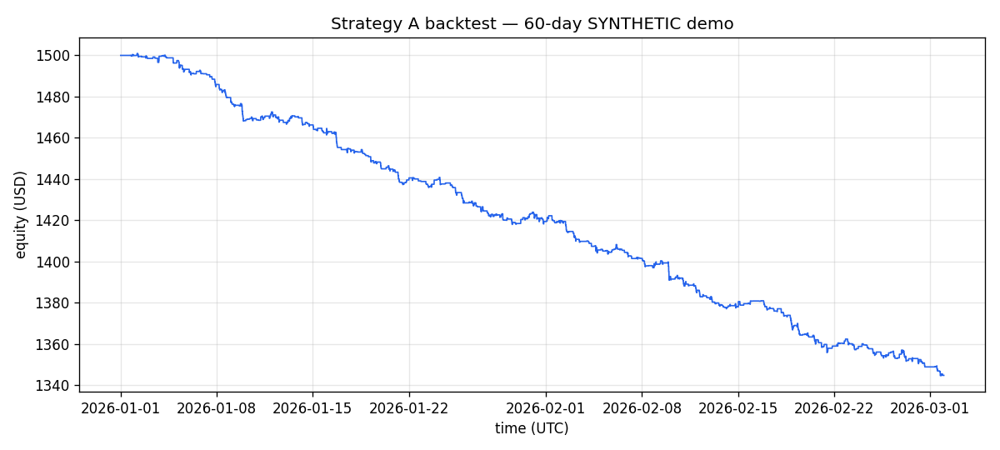

# Strategy A backtest — 60-day SYNTHETIC demo

> **Note**: **This run uses a synthetic dataset, not real Hyperliquid data.** It exists to demonstrate the backtester end-to-end and to exercise both a target-exit and a stop-out. The real 180-day backtest is run via `scripts/run_backtest.py` on a machine with network access to Hyperliquid; the report path is the same so re-running on real data overwrites this file.

## Headline metrics

| Metric | Value |
| --- | --- |
| Total trades | 861 |
| Win rate | 39.37% |
| Profit factor | 0.57 |
| Avg trade P&L | $-0.18 |
| Sharpe (annualised) | -15.93 |
| Max drawdown | -10.41% |
| Total P&L | $-155.14 |
| Fees paid | $116.24 |
| Slippage paid | $19.37 |
| Skipped signals (ALO no-fill) | 375 |

## Configuration

| Parameter | Value |
| --- | --- |
| Initial equity | $1,500.00 |
| z entry | 2.0 |
| z stop | 3.5 |
| z target | 0.0 |
| Time stop (bars) | 4 |
| RSI window | 14 |
| RSI oversold/overbought | 30.0 / 70.0 |
| SMA window | 96 |
| Risk per trade | 0.50% |
| Max notional | 30% of equity |
| Maker fee | 0.0150% per side |
| Slippage | 0.5 bps per fill |
| ALO fill probability | 70% |
| RNG seed | 42 |

## Per-symbol breakdown

| Symbol | Trades | Wins | Win rate | Total P&L | Avg P&L | Fees |
| --- | ---: | ---: | ---: | ---: | ---: | ---: |
| BTC | 300 | 119 | 39.67% | $-49.97 | $-0.17 | $40.50 |
| ETH | 293 | 116 | 39.59% | $-55.25 | $-0.19 | $39.55 |
| SOL | 268 | 104 | 38.81% | $-49.92 | $-0.19 | $36.18 |

## Exit reason breakdown

| Reason | Count | Total P&L | Avg P&L |
| --- | ---: | ---: | ---: |
| stop | 48 | $-43.04 | $-0.90 |
| target | 1 | $3.20 | $3.20 |
| time_stop | 812 | $-115.29 | $-0.14 |

## Run details

- **data_source**: synthetic (deterministic, seed below)
- **rng_seed**: 20260428
- **days**: 60
- **coins**: BTC, ETH, SOL
- **per_bar_log_return_std**: 0.0008
- **planted_events**: BTC bar n/4: 2.5σ drop reverting in ~3 bars (target). BTC bar 3n/4: 2.5σ drop with continued 4σ slide (stop-out).
- **generated_at**: 2026-04-28T06:35:59.764474+00:00

