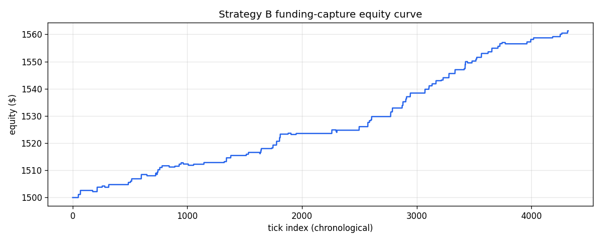

# Strategy B backtest — 60-day SYNTHETIC demo

> **This run uses a synthetic funding history, not real Hyperliquid data.** It exists to demonstrate the simulator end-to-end and to exercise both the paired-fill success path and the unhedged-leg failure path. The real 180-day run is `scripts/run_funding_backtest.py` and overwrites this file.

## Summary

| Metric | Value |
| --- | --- |
| Total ticks observed | 4320 |
| Skipped (below threshold) | 4230 |
| Attempted captures | 90 |
| Succeeded (paired fill) | 77 |
| Failed (unhedged → unwound) | 13 |
| Win rate | 85.56% |
| Funding received (gross) | $114.31 |
| Fees paid | $40.27 |
| Slippage paid | $12.76 |
| Total P&L | $61.28 |
| Initial equity | $1,500.00 |
| Final equity | $1,561.28 |
| Equity return | 4.09% |

## Configuration

| Parameter | Value |
| --- | --- |
| Funding threshold | 0.10% |
| Pre-tick entry (s) | 600 |
| Fill window (s) | 90 |
| Post-tick exit min (s) | 60 |
| Post-tick exit max (s) | 120 |
| Maker fee per side | 1.50 bps |
| Taker fee (unwind) | 3.50 bps |
| Slippage per leg | 0.50 bps |
| Paired-fill probability | 80.00% |
| Notional per leg | 50.00% |
| Initial equity | $1,500.00 |
| RNG seed | 42 |

## Per-coin breakdown

| Coin | Attempts | Won | Lost | Funding | Fees | Slippage | Net P&L |
| --- | ---: | ---: | ---: | ---: | ---: | ---: | ---: |
| BTC | 30 | 26 | 4 | $40.54 | $13.46 | $4.28 | $22.80 |
| ETH | 30 | 25 | 5 | $37.08 | $13.36 | $4.20 | $19.52 |
| SOL | 30 | 26 | 4 | $36.69 | $13.45 | $4.28 | $18.96 |

## Capture attempts

| Tick (UTC) | Coin | Funding | Notional | Outcome | Fills | Funding $ | Fees | Slippage | Net P&L | Note |
| --- | --- | ---: | ---: | --- | ---: | ---: | ---: | ---: | ---: | --- |
| 2026-02-01 16:00 | ETH | 0.23% | $750.00 | success | 4 | $1.74 | $0.45 | $0.15 | $1.14 | both legs filled, held through tick |
| 2026-02-01 22:00 | ETH | 0.28% | $750.57 | success | 4 | $2.08 | $0.45 | $0.15 | $1.48 | both legs filled, held through tick |
| 2026-02-03 10:00 | BTC | 0.24% | $751.31 | fill_failure | 2 | $0.00 | $0.38 | $0.08 | $-0.45 | one leg unfilled within 90s; filled leg market-unwound |
| 2026-02-03 23:00 | BTC | 0.30% | $751.09 | success | 4 | $2.24 | $0.45 | $0.15 | $1.64 | both legs filled, held through tick |
| 2026-02-04 13:00 | SOL | 0.14% | $751.90 | success | 4 | $1.03 | $0.45 | $0.15 | $0.43 | both legs filled, held through tick |
| 2026-02-04 21:00 | ETH | 0.20% | $752.12 | fill_failure | 2 | $0.00 | $0.38 | $0.08 | $-0.45 | one leg unfilled within 90s; filled leg market-unwound |
| 2026-02-05 08:00 | SOL | 0.21% | $751.89 | success | 4 | $1.57 | $0.45 | $0.15 | $0.97 | both legs filled, held through tick |
| 2026-02-07 17:00 | SOL | 0.19% | $752.38 | success | 4 | $1.42 | $0.45 | $0.15 | $0.82 | both legs filled, held through tick |
| 2026-02-08 00:00 | BTC | 0.14% | $752.79 | success | 4 | $1.04 | $0.45 | $0.15 | $0.44 | both legs filled, held through tick |
| 2026-02-08 03:00 | ETH | 0.20% | $753.00 | success | 4 | $1.49 | $0.45 | $0.15 | $0.89 | both legs filled, held through tick |
| 2026-02-09 07:00 | ETH | 0.29% | $753.45 | success | 4 | $2.17 | $0.45 | $0.15 | $1.57 | both legs filled, held through tick |
| 2026-02-09 23:00 | SOL | 0.19% | $754.23 | fill_failure | 2 | $0.00 | $0.38 | $0.08 | $-0.45 | one leg unfilled within 90s; filled leg market-unwound |
| 2026-02-11 01:00 | BTC | 0.21% | $754.00 | success | 4 | $1.55 | $0.45 | $0.15 | $0.95 | both legs filled, held through tick |
| 2026-02-11 03:00 | SOL | 0.25% | $754.48 | fill_failure | 2 | $0.00 | $0.38 | $0.08 | $-0.45 | one leg unfilled within 90s; filled leg market-unwound |
| 2026-02-11 05:00 | SOL | 0.19% | $754.25 | success | 4 | $1.43 | $0.45 | $0.15 | $0.82 | both legs filled, held through tick |
| 2026-02-11 07:00 | SOL | 0.20% | $754.66 | success | 4 | $1.50 | $0.45 | $0.15 | $0.90 | both legs filled, held through tick |
| 2026-02-11 13:00 | BTC | 0.19% | $755.11 | success | 4 | $1.43 | $0.45 | $0.15 | $0.83 | both legs filled, held through tick |
| 2026-02-11 19:00 | SOL | 0.16% | $755.53 | success | 4 | $1.22 | $0.45 | $0.15 | $0.62 | both legs filled, held through tick |
| 2026-02-12 16:00 | ETH | 0.20% | $755.84 | fill_failure | 2 | $0.00 | $0.38 | $0.08 | $-0.45 | one leg unfilled within 90s; filled leg market-unwound |
| 2026-02-13 08:00 | SOL | 0.12% | $755.61 | success | 4 | $0.90 | $0.45 | $0.15 | $0.30 | both legs filled, held through tick |
| 2026-02-13 21:00 | ETH | 0.18% | $755.76 | success | 4 | $1.36 | $0.45 | $0.15 | $0.75 | both legs filled, held through tick |
| 2026-02-14 03:00 | BTC | 0.15% | $756.13 | success | 4 | $1.11 | $0.45 | $0.15 | $0.50 | both legs filled, held through tick |
| 2026-02-14 09:00 | ETH | 0.25% | $756.39 | fill_failure | 2 | $0.00 | $0.38 | $0.08 | $-0.45 | one leg unfilled within 90s; filled leg market-unwound |
| 2026-02-15 00:00 | BTC | 0.15% | $756.16 | fill_failure | 2 | $0.00 | $0.38 | $0.08 | $-0.45 | one leg unfilled within 90s; filled leg market-unwound |
| 2026-02-15 15:00 | ETH | 0.13% | $755.93 | success | 4 | $0.99 | $0.45 | $0.15 | $0.38 | both legs filled, held through tick |
| 2026-02-16 21:00 | ETH | 0.16% | $756.12 | success | 4 | $1.21 | $0.45 | $0.15 | $0.61 | both legs filled, held through tick |
| 2026-02-19 08:00 | ETH | 0.13% | $756.43 | success | 4 | $0.95 | $0.45 | $0.15 | $0.35 | both legs filled, held through tick |
| 2026-02-19 14:00 | SOL | 0.26% | $756.60 | success | 4 | $2.00 | $0.45 | $0.15 | $1.40 | both legs filled, held through tick |
| 2026-02-20 03:00 | ETH | 0.19% | $757.30 | success | 4 | $1.45 | $0.45 | $0.15 | $0.85 | both legs filled, held through tick |
| 2026-02-22 00:00 | ETH | 0.14% | $757.72 | success | 4 | $1.08 | $0.45 | $0.15 | $0.47 | both legs filled, held through tick |
| 2026-02-22 06:00 | SOL | 0.17% | $757.96 | success | 4 | $1.27 | $0.45 | $0.15 | $0.66 | both legs filled, held through tick |
| 2026-02-23 15:00 | SOL | 0.12% | $758.29 | fill_failure | 2 | $0.00 | $0.38 | $0.08 | $-0.45 | one leg unfilled within 90s; filled leg market-unwound |
| 2026-02-23 17:00 | BTC | 0.14% | $758.06 | success | 4 | $1.09 | $0.45 | $0.15 | $0.48 | both legs filled, held through tick |
| 2026-02-23 19:00 | BTC | 0.19% | $758.31 | success | 4 | $1.43 | $0.45 | $0.15 | $0.82 | both legs filled, held through tick |
| 2026-02-23 20:00 | BTC | 0.15% | $758.72 | success | 4 | $1.17 | $0.46 | $0.15 | $0.57 | both legs filled, held through tick |
| 2026-02-25 02:00 | SOL | 0.11% | $759.00 | success | 4 | $0.85 | $0.46 | $0.15 | $0.24 | both legs filled, held through tick |
| 2026-02-25 06:00 | BTC | 0.22% | $759.12 | success | 4 | $1.65 | $0.46 | $0.15 | $1.05 | both legs filled, held through tick |
| 2026-02-25 16:00 | ETH | 0.26% | $759.64 | success | 4 | $2.01 | $0.46 | $0.15 | $1.40 | both legs filled, held through tick |
| 2026-02-26 01:00 | BTC | 0.26% | $760.35 | success | 4 | $1.94 | $0.46 | $0.15 | $1.33 | both legs filled, held through tick |
| 2026-02-26 03:00 | BTC | 0.25% | $761.01 | success | 4 | $1.89 | $0.46 | $0.15 | $1.28 | both legs filled, held through tick |
| 2026-02-27 02:00 | BTC | 0.12% | $761.65 | success | 4 | $0.93 | $0.46 | $0.15 | $0.33 | both legs filled, held through tick |
| 2026-02-27 10:00 | ETH | 0.12% | $761.82 | fill_failure | 2 | $0.00 | $0.38 | $0.08 | $-0.46 | one leg unfilled within 90s; filled leg market-unwound |
| 2026-02-28 01:00 | ETH | 0.13% | $761.59 | success | 4 | $0.98 | $0.46 | $0.15 | $0.37 | both legs filled, held through tick |
| 2026-03-04 09:00 | BTC | 0.25% | $761.78 | success | 4 | $1.93 | $0.46 | $0.15 | $1.32 | both legs filled, held through tick |
| 2026-03-04 21:00 | BTC | 0.13% | $762.43 | fill_failure | 2 | $0.00 | $0.38 | $0.08 | $-0.46 | one leg unfilled within 90s; filled leg market-unwound |
| 2026-03-04 22:00 | SOL | 0.19% | $762.21 | fill_failure | 2 | $0.00 | $0.38 | $0.08 | $-0.46 | one leg unfilled within 90s; filled leg market-unwound |
| 2026-03-04 23:00 | SOL | 0.18% | $761.98 | success | 4 | $1.41 | $0.46 | $0.15 | $0.80 | both legs filled, held through tick |
| 2026-03-07 16:00 | ETH | 0.25% | $762.38 | success | 4 | $1.92 | $0.46 | $0.15 | $1.31 | both legs filled, held through tick |
| 2026-03-08 17:00 | SOL | 0.28% | $763.03 | success | 4 | $2.16 | $0.46 | $0.15 | $1.55 | both legs filled, held through tick |
| 2026-03-08 22:00 | ETH | 0.17% | $763.81 | success | 4 | $1.28 | $0.46 | $0.15 | $0.67 | both legs filled, held through tick |
| 2026-03-09 02:00 | SOL | 0.12% | $764.14 | success | 4 | $0.90 | $0.46 | $0.15 | $0.29 | both legs filled, held through tick |
| 2026-03-09 04:00 | SOL | 0.24% | $764.29 | success | 4 | $1.80 | $0.46 | $0.15 | $1.19 | both legs filled, held through tick |
| 2026-03-11 12:00 | BTC | 0.27% | $764.88 | success | 4 | $2.05 | $0.46 | $0.15 | $1.43 | both legs filled, held through tick |
| 2026-03-11 12:00 | SOL | 0.12% | $765.60 | success | 4 | $0.91 | $0.46 | $0.15 | $0.30 | both legs filled, held through tick |
| 2026-03-11 17:00 | BTC | 0.26% | $765.75 | success | 4 | $2.02 | $0.46 | $0.15 | $1.41 | both legs filled, held through tick |
| 2026-03-12 21:00 | ETH | 0.20% | $766.45 | success | 4 | $1.56 | $0.46 | $0.15 | $0.95 | both legs filled, held through tick |
| 2026-03-12 23:00 | SOL | 0.26% | $766.93 | success | 4 | $1.96 | $0.46 | $0.15 | $1.35 | both legs filled, held through tick |
| 2026-03-13 08:00 | BTC | 0.21% | $767.60 | success | 4 | $1.64 | $0.46 | $0.15 | $1.02 | both legs filled, held through tick |
| 2026-03-13 10:00 | BTC | 0.19% | $768.11 | success | 4 | $1.44 | $0.46 | $0.15 | $0.83 | both legs filled, held through tick |
| 2026-03-13 21:00 | BTC | 0.26% | $768.53 | success | 4 | $1.96 | $0.46 | $0.15 | $1.35 | both legs filled, held through tick |
| 2026-03-15 15:00 | SOL | 0.26% | $769.20 | success | 4 | $2.01 | $0.46 | $0.15 | $1.40 | both legs filled, held through tick |
| 2026-03-16 03:00 | BTC | 0.16% | $769.90 | success | 4 | $1.22 | $0.46 | $0.15 | $0.60 | both legs filled, held through tick |
| 2026-03-16 03:00 | SOL | 0.17% | $770.20 | success | 4 | $1.29 | $0.46 | $0.15 | $0.67 | both legs filled, held through tick |
| 2026-03-16 12:00 | ETH | 0.18% | $770.54 | success | 4 | $1.35 | $0.46 | $0.15 | $0.74 | both legs filled, held through tick |
| 2026-03-16 23:00 | SOL | 0.23% | $770.90 | success | 4 | $1.75 | $0.46 | $0.15 | $1.14 | both legs filled, held through tick |
| 2026-03-17 15:00 | ETH | 0.11% | $771.47 | success | 4 | $0.85 | $0.46 | $0.15 | $0.24 | both legs filled, held through tick |
| 2026-03-17 20:00 | ETH | 0.19% | $771.59 | success | 4 | $1.47 | $0.46 | $0.15 | $0.85 | both legs filled, held through tick |
| 2026-03-18 13:00 | ETH | 0.28% | $772.02 | success | 4 | $2.16 | $0.46 | $0.15 | $1.55 | both legs filled, held through tick |
| 2026-03-19 07:00 | BTC | 0.26% | $772.79 | success | 4 | $2.02 | $0.46 | $0.15 | $1.40 | both legs filled, held through tick |
| 2026-03-20 09:00 | SOL | 0.13% | $773.49 | success | 4 | $1.00 | $0.46 | $0.15 | $0.38 | both legs filled, held through tick |
| 2026-03-20 12:00 | ETH | 0.27% | $773.68 | success | 4 | $2.12 | $0.46 | $0.15 | $1.50 | both legs filled, held through tick |
| 2026-03-20 13:00 | ETH | 0.22% | $774.44 | success | 4 | $1.71 | $0.46 | $0.15 | $1.09 | both legs filled, held through tick |
| 2026-03-20 19:00 | ETH | 0.18% | $774.98 | fill_failure | 2 | $0.00 | $0.39 | $0.08 | $-0.46 | one leg unfilled within 90s; filled leg market-unwound |
| 2026-03-21 08:00 | ETH | 0.17% | $774.75 | success | 4 | $1.30 | $0.46 | $0.15 | $0.68 | both legs filled, held through tick |
| 2026-03-21 19:00 | SOL | 0.17% | $775.09 | success | 4 | $1.32 | $0.47 | $0.16 | $0.70 | both legs filled, held through tick |
| 2026-03-21 22:00 | BTC | 0.17% | $775.44 | success | 4 | $1.28 | $0.47 | $0.16 | $0.66 | both legs filled, held through tick |
| 2026-03-22 11:00 | SOL | 0.26% | $775.77 | success | 4 | $2.04 | $0.47 | $0.16 | $1.42 | both legs filled, held through tick |
| 2026-03-23 07:00 | BTC | 0.16% | $776.48 | success | 4 | $1.22 | $0.47 | $0.16 | $0.60 | both legs filled, held through tick |
| 2026-03-23 18:00 | BTC | 0.25% | $776.78 | success | 4 | $1.94 | $0.47 | $0.16 | $1.32 | both legs filled, held through tick |
| 2026-03-24 11:00 | SOL | 0.17% | $777.44 | success | 4 | $1.32 | $0.47 | $0.16 | $0.70 | both legs filled, held through tick |
| 2026-03-24 17:00 | ETH | 0.21% | $777.79 | success | 4 | $1.60 | $0.47 | $0.16 | $0.98 | both legs filled, held through tick |
| 2026-03-24 23:00 | SOL | 0.13% | $778.28 | success | 4 | $1.03 | $0.47 | $0.16 | $0.41 | both legs filled, held through tick |
| 2026-03-25 09:00 | BTC | 0.19% | $778.49 | fill_failure | 2 | $0.00 | $0.39 | $0.08 | $-0.47 | one leg unfilled within 90s; filled leg market-unwound |
| 2026-03-28 00:00 | BTC | 0.17% | $778.25 | success | 4 | $1.31 | $0.47 | $0.16 | $0.69 | both legs filled, held through tick |
| 2026-03-28 11:00 | BTC | 0.20% | $778.60 | success | 4 | $1.55 | $0.47 | $0.16 | $0.92 | both legs filled, held through tick |
| 2026-03-28 19:00 | ETH | 0.15% | $779.06 | success | 4 | $1.20 | $0.47 | $0.16 | $0.58 | both legs filled, held through tick |
| 2026-03-31 02:00 | SOL | 0.14% | $779.35 | success | 4 | $1.06 | $0.47 | $0.16 | $0.44 | both legs filled, held through tick |
| 2026-04-01 00:00 | SOL | 0.19% | $779.57 | success | 4 | $1.51 | $0.47 | $0.16 | $0.89 | both legs filled, held through tick |
| 2026-04-01 05:00 | ETH | 0.13% | $780.01 | success | 4 | $1.03 | $0.47 | $0.16 | $0.41 | both legs filled, held through tick |
| 2026-04-01 22:00 | BTC | 0.19% | $780.22 | success | 4 | $1.46 | $0.47 | $0.16 | $0.84 | both legs filled, held through tick |

## Run details

- **generated_at**: 2026-04-28T08:26:17.404582+00:00
- **data_source**: synthetic (deterministic, seed below)
- **rng_seed**: 20260428
- **days**: 60
- **coins**: BTC,ETH,SOL
- **tick_count**: 4320
- **planted_spikes_per_coin**: 30
